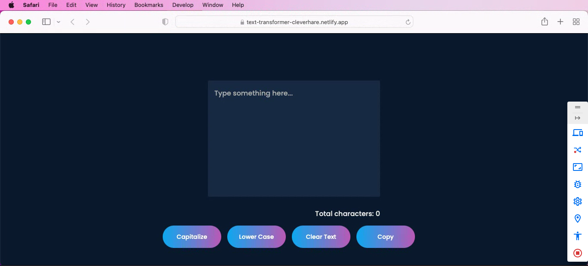

# Text Transformer Using JavaScript
This is an app that performs some operations on the entered text. The app is made using Vanilla JavaScript and also it is tried to make a good UI for this app


## Quickly check how it looks




## to get this project on your local machine follow this

Clone the project into your machine

```bash
  git clone git@github.com:cleverhare/Text-Operations-Using-JavaScript.git
```

Go to the project directory


Find the Index File

```bash
  Double click on the index file to run it on your default browser
```


## FAQ

#### How should I contribute?

To contribute on this open source project. You just need to star and fork the repo to  your github. 
Once done clone it on your local machine and do the changes. And accodingly generate a PR solving an issue.


#### Can I view it without downloading ?

Yes ofcourse. You can view it online at text-transformer-cleverhare.netlify.app


## Contributors

- [@cleverhare](https://www.github.com/cleverhare)

 


## 🛠 Technologies Used

HTML, CSS,  JavaScript

## Acknoledgement

Thanks for making it till the very end. Have a nice day. And don't forget to view it [Live](text-transformer-cleverhare.netlify.app) 

